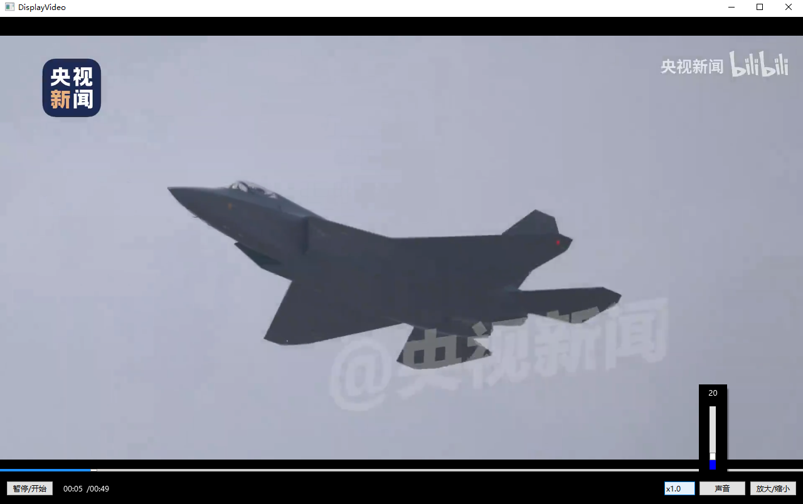
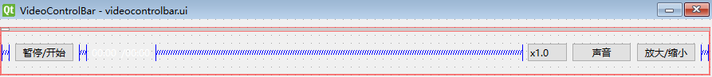
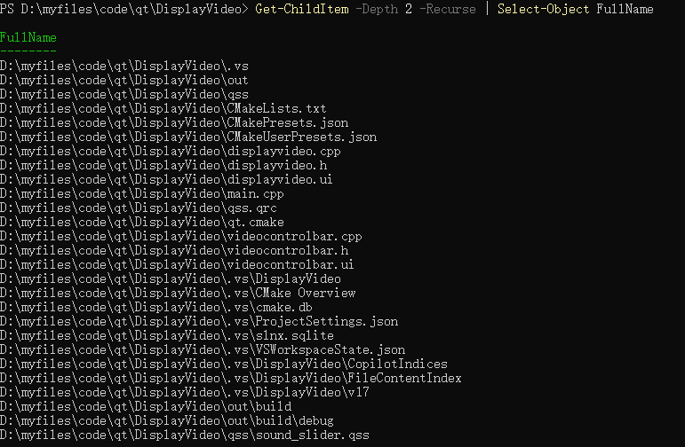

此篇是我在观看[使用nginx搭建音视频点播服务器 - seedoubleu - 博客园](https://www.cnblogs.com/seedoubleu/p/15665408.html)后,想着使用qt widget写的一个简单播放器

完成nginx搭建音视频点播服务器的话,我推荐使用ffplay进行验证.再推荐一个视频[【音视频】FFmpeg音视频入门到精通+实战课_哔哩哔哩_bilibili](https://www.bilibili.com/video/BV1a1421k7Eo?spm_id_from=333.788.videopod.episodes&vd_source=b0eea03428e9cfdb88b44ab08c9ab5f8)

同时推荐一个好用的视频下载工具(支持bilibili视频下载)[KurtBestor/Hitomi-Downloader: :cake: Desktop utility to download images/videos/music/text from various websites, and more.](https://github.com/KurtBestor/Hitomi-Downloader)

下图是最终写出来的界面(一共就俩界面文件,一个是displayVideo播放视频窗口,一个是videocontrolbar的视频控制栏(详细代码查看[my_learnt/DisplayVideo at main · haoyouxiaoju/my_learnt](https://github.com/haoyouxiaoju/my_learnt/tree/main/DisplayVideo))

- 如果有其他不懂的地方可以私信我,看到的话会回复



其中controlbar简单的使用designer拖拽出来

这里只写一些注意事项:

我使用的是qt6.8 同时项目也是cmake项目

- 在使用qrc管理资源时,你可能会发现QFile没法找到qrc管理的文件这时候你得在cmakeLists.txt中查看

```
# 启用 Qt 资源支持
set(CMAKE_AUTORCC ON)  # 必须开启(否则qrc文件无法参与编译)
```

- QVideoWidget是一个特殊的渲染widget,需要设置一下鼠标穿透

```
setAttribute(Qt::WA_TransparentForMouseEvents, true);
```

- 同时使用过程中发现视频开头会黑屏

```
//写这个的原因是以为视频开头会黑屏,如果直接设置player的position为0不能解决
//通过尝试,设置105刚刚好
//可能跟视频的关键帧有关吧
QTimer* timer = new QTimer;
connect(timer, &QTimer::timeout, [=]() {
	qDebug() << "Media status:" << player->mediaStatus();
	qDebug() << "是否支持seek:" << player->isSeekable(); // 此时再检查
	if (player->isSeekable() == true) {
		player->setPosition(105);
		qDebug() << "durantion" << player->duration();
		timer->stop();
        timer->deleteLater();
	}
	});
timer->start(1000); // 每 100ms 检查一次 
```

- 这里的话是因为v_widget和controlBar没有挂靠在DisplayVideo,是popup所以在移动和resize DisplayVideo的时候要重新设置v_widget和controlBar,提示一下如果构造函数中new出来的widget没有挂靠在其他widget的话记得在析构函数中delete

```
void DisplayVideo::resizeEvent(QResizeEvent * event)
{
    QWidget::resizeEvent(event);
    v_widget->resize(event->size());
	bar->resize(QSize(event->size().width(), bar->height()));
    QPoint point = v_widget->mapToGlobal(QPoint(0, 0));
	bar->move(point.x(), point.y() + v_widget->height() - bar->height());
}

void DisplayVideo::moveEvent(QMoveEvent* event)
{
    QWidget::moveEvent(event);
    //if (bar->isVisible()) {
		bar->move(event->pos().x(), event->pos().y() + v_widget->height() - bar->height());
    //}
}
```

- 设置视频播放速度使用QCombobox,在点击combobox时出现异常,controlbar会hide所以添加了事件过滤

```
// controlBar的构造函数添加
ui.comboBox->installEventFilter(this);

bool VideoControlBar::eventFilter(QObject* obj, QEvent* event)
{
	if (obj == ui.comboBox && event->type() == QEvent::MouseButtonPress) {
		QMouseEvent* mouseEvent = static_cast<QMouseEvent*>(event);
		if (mouseEvent->button() == Qt::LeftButton) {
			// 阻止事件继续传播
			event->accept();
			ui.comboBox->showPopup();
			return true;
		}
	}
	return QWidget::eventFilter(obj, event);
}
```

- 我现在还没找到解决方法一个问题就是设置background-color:rgba没有效果,如果你知道怎么解决,请告诉我


